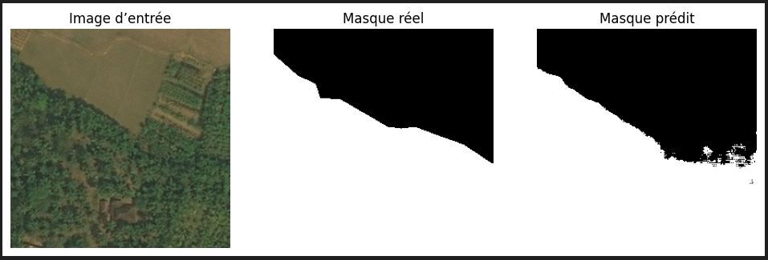
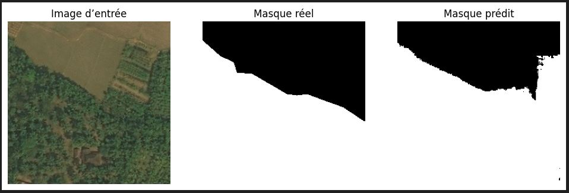
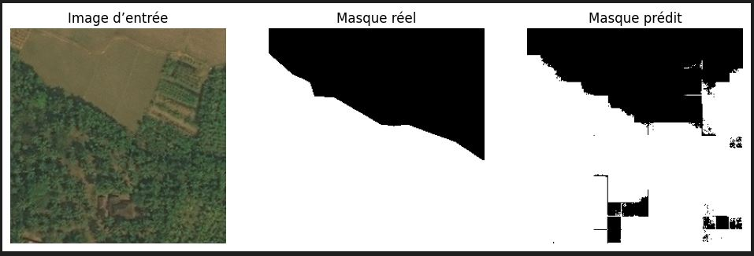
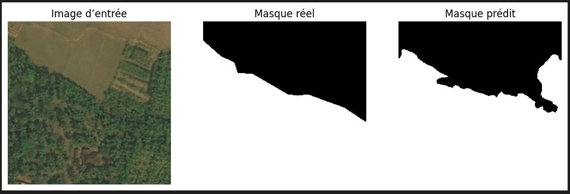
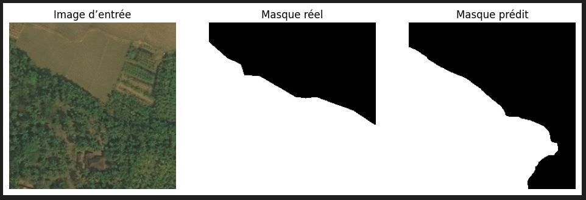

# Augmented Forest Segmentation Benchmark

This project benchmarks deep learning models, including **U-Net, Attention U-Net, DeepLabV3+, HRNet, and UNETR**, using **TensorFlow** to evaluate their performance in achieving precise segmentation of forest images. The main goal is to compare these models in terms of accuracy, robustness, and ability to capture fine details in complex forest environments.

- 📄 Rapport du projet
Un aperçu détaillé du travail réalisé est disponible dans le document suivant :
👉 [📘 Overview Of Some Segmentation Models (PDF)](Overview%20Of%20Some%20Segmentation%20Models.pdf)
## Overview

Ce projet se concentre sur la détection et la segmentation des zones forestières dans les images en utilisant des architectures de deep learning de pointe. Il exploite différents modèles de segmentation sémantique pour fournir une identification précise et efficace de la végétation et des autres composantes forestières.
L'objectif principal est de comparer la performance de différents modèles pour des tâches de segmentation d'images environnementales et d'évaluer leur efficacité à l'aide de métriques telles que la Loss, le Dice Coefficient, l'Intersection over Union (IoU), le Recall et la Precision.
## Dataset

Le projet utilise le dataset **[Augmented Forest Segmentation](https://www.kaggle.com/datasets/quadeer15sh/augmented-forest-segmentation)** disponible sur Kaggle.  

### Contexte
La catégorisation et la segmentation automatiques de la couverture forestière sont essentielles pour le développement durable et l'aménagement urbain. Les forêts jouent un rôle clé dans les services écosystémiques tels que la fibre, l’énergie, les loisirs, la biodiversité, le stockage et le flux de carbone, ainsi que la gestion de l’eau. Elles doivent également être identifiées avant toute activité industrielle nécessitant un travail sur le terrain.  
Les images satellites ou issues de la télédétection peuvent être utilisées pour identifier et segmenter les zones forestières, permettant ainsi d’estimer la surface occupée par les forêts. Cette tâche est définie comme un **problème de segmentation binaire** pour détecter les zones forestières.

### Contenu
- Le dataset contient **5108 images aériennes** de dimension **256x256 pixels**.  
- Le fichier **meta_data.csv** fournit les informations concernant les images aériennes et leurs masques binaires correspondants.
## Modèles utilisés

Le projet inclut plusieurs modèles de segmentation d’images basés sur le deep learning, afin de comparer leurs performances pour la segmentation des zones forestières :  

- **U-Net** : Architecture classique encodeur-décodeur avec des connexions de type "skip" pour récupérer les détails spatiaux perdus lors de l'encodage.  
- **Attention U-Net** : Extension du U-Net intégrant des modules d’attention pour se concentrer sur les régions pertinentes et améliorer la segmentation des objets complexes ou petits.  
- **DeepLabV3+** : Utilise le module Atrous Spatial Pyramid Pooling (ASPP) pour extraire des caractéristiques multi-échelles et segmenter efficacement des objets de tailles variées.  
- **HRNet** : Maintient des représentations à haute résolution tout au long du réseau pour préserver les détails fins et obtenir une segmentation précise.  
- **UNETR** : Combine les Transformers avec une architecture de type U-Net pour capturer les dépendances globales et les détails locaux, particulièrement utile pour les structures complexes et variées.
## Métriques d’évaluation

Pour comparer les performances des modèles de segmentation, plusieurs métriques standards sont utilisées :  

- **Loss** : Mesure l’erreur globale entre les prédictions et les masques réels.  
- **Dice Coefficient** : Évalue la similarité entre la segmentation prédite et la vérité terrain ; une valeur proche de 1 indique une très bonne correspondance.  
- **Intersection over Union (IoU)** : Mesure le chevauchement entre les pixels prédits et les pixels réels de la classe d’intérêt.  
- **Recall (Rappel)** : Proportion des pixels de la forêt correctement identifiés parmi tous les pixels forestiers réels.  
- **Precision (Précision)** : Proportion des pixels prédits comme forêt qui sont effectivement des pixels forestiers.
## 📊 Résultats

| Modèle          | IoU  | Dice Coefficient | Précision | Rappel | Loss  |
|-----------------|------|------------------|------------|---------|-------|
| **DeepLabV3+**      | **0.8093** | 0.8946 | **0.9208** | 0.8698 | **0.2973** |
| **HRNet**           | 0.8201 | 0.9012 | 0.8760 | **0.9278** | 0.3348 |
| **Attention-UNet**  | **0.8243** | **0.9037** | 0.8858 | 0.9223 | 0.3267 |
| **UNetR**           | 0.7539 | 0.8597 | 0.8351 | 0.8858 | 0.4178 |
| **UNet**            | 0.8114 | 0.8959 | 0.8334 | **0.9684** | 0.3356 |

---
Les résultats mettent en évidence **Attention-UNet** et **DeepLabV3+** comme les modèles les plus performants pour la **segmentation de la couverture forestière**.  

- **Attention-UNet** a obtenu le **meilleur Dice Coefficient (0.9037)** et un **rappel élevé (0.9223)**, démontrant une excellente capacité à capturer les zones forestières dans leur globalité.  
- **DeepLabV3+**, avec un **Dice de 0.8946** et la **meilleure précision (0.9208)**, montre une excellente performance dans la **délimitation précise** des frontières des zones forestières.  

Ces deux modèles offrent un **équilibre optimal entre sensibilité de détection et précision de segmentation**, ce qui en fait les **approches les plus efficaces** pour cette tâche de segmentation binaire.
Les performances obtenues sont prometteuses, mais les modèles peuvent encore être améliorés par une optimisation des hyperparamètres, une meilleure augmentation des données ou l’intégration de techniques plus récentes.
## 🌲 Visualisation des résultats

Les figures suivantes illustrent les **résultats de segmentation obtenus par différents modèles** sur des échantillons du jeu de données *Augmented Forest Segmentation*.  
Chaque image montre la comparaison entre :  
- **L’image d’entrée**  
- **Le masque réel (Ground Truth)**  
- **Le masque prédit par le modèle**

### 🔹 Attention U-Net

### 🔹 U-Net

### 🔹 UNETR

### 🔹 HRNet

### 🔹 DeepLabV3+

---
Ces visualisations mettent en évidence les **différences de précision et de cohérence spatiale** entre les modèles.  
On observe notamment que :
- **Attention U-Net** et **DeepLabV3+** produisent des masques plus homogènes et mieux alignés avec les contours réels des zones forestières.  
- **HRNet** montre une bonne capacité de généralisation, mais avec une légère tendance à la surestimation.  
- **UNETR** reste moins précis, ce qui peut être lié à la complexité du modèle et au besoin d’un plus grand nombre d’échantillons pour un entraînement optimal.

